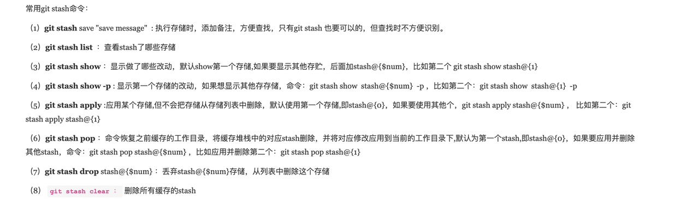

# 简介 v1.0
这是一个Git、Repo、Github-cli(gh)的使用方法介绍文档
# Git初步
[这里是一个保姆级的Git教程](https://github.com/CoderLeixiaoshuai/java-eight-part/blob/master/docs/tools/git/%E4%BF%9D%E5%A7%86%E7%BA%A7Git%E6%95%99%E7%A8%8B%EF%BC%8C10000%E5%AD%97%E8%AF%A6%E8%A7%A3.md)

## 1. Git安装与配置(ubuntu)
```bash
sudo apt-get install git

git config --global user.name jackhu # 配置用户名
git config --global user.email jackhu.521.rose@gmail.com # 用户邮箱
git config --list
```

## 2. 配置字节的内部代理（如果没有字节代理不需要配置）
```bash
vi ~/.gitconfig
#添加如下内容
[url "gitr:"]
    insteadOf = git://git.byted.org/
[url "git@code.byted.org:"]
     insteadOf = https://code.byted.org/
[url "ssh://liping.zedd@git.byted.org:29418"]
     insteadOf = https://git.byted.org
```
## 3. 建立仓库，并且将ssh密钥导入仓库
```bash
ssh-keygen -t ed25519 -C jackhu.521.rose@gmail.com
cat ~/.ssh/id_ed25519.pub

# 然后添加到github/gitee仓库的SSH KEY中
```

## 4. AutoComplete（配置自动补齐命令）
```bash
curl https://raw.githubusercontent.com/git/git/master/contrib/completion/git-completion.bash -o ~/.git-completion.bash

# 将下文添加到.bashrc中
if [ -f ~/.git-completion.bash ]; then
. ~/.git-completion.bash
fi
# 添加完毕

chmod +x ~/.git-completion.bash
source ~/.bashrc
```

# Git使用方法快速索引
## 本地使用
```bash
git remote add origin <仓库的ssh地址>
git init
git add .
git commit -m '提交时的说明'
git push -u origin master
```
## 拉取使用
```bash
git clone <仓库ssh地址> <本地新建文件夹名>
# 如
git clone git@github.com:Huzhiwen1208/rcore-with-libos.git
# 或者
git clone git@github.com:Huzhiwen1208/rcore-with-libos.git libos
```
## 删除分支
```bash
# 删除本地分支
git branch -D <name>  
# 删除远程分支
git push origin --delete <name> 
# 清理本地已删除分支的分支自动补全
git remote prune origin 
```
## 合并冲突解决
```bash
# 主分支
git checkout master
git pull
# 切入开发分支
git checkout <开发分支>
# 同步最新主分支内容
git merge master
# 本地解决冲突后可提交PR/MR
```
## 撤销回退
```bash
# 回退到某一个commit结点
git reset --hard <commit_hash>
git revert <commit_hash>

# 撤销最近一次commit
git reset HEAD~1
```
## Cherry-pick
```bash
# git cherry-pick是一个Git命令，它用于将指定的提交（commit）应用到当前分支上。具体来说，git cherry-pick会将指定的提交的更改应用到当前分支上，并生成一个新的提交来保存这些更改。
git cherry-pick <commit-hash>
```
## Git暂存

## Git Rebase
```bash
git rebase <branch> # 将目标branch分支的所有commit合并到当前所在分支，不产生新的commit
```
## Git 从某一分支的某一个commit拉出新分支
```bash
#  当前分支：A
git branch <newBranch> <commitHashInA>
```
## Gitignore 失效
```bash
git rm -r --cached . 
git add .
git commit -m 'take ignore effect'
```
# Git Flow
[git工作流推荐阅读](https://blog.csdn.net/sunyctf/article/details/130587970)

# Repo常用
[repo工具使用参考](https://git-repo.info/en/docs/multi-repos/overview/)
## 常用工具方法
```bash
# 显示所有仓库的状态，包括修改、未提交的变更和当前分支。
repo status
# 显示当前分支与上游分支之间的差异。
repo diff
# 清理不再跟踪的分支和项目，释放磁盘空间。
repo prune
```
## 同时 PULL 多个仓库
```bash
repo forall -r rel4_kernel kernel -vc "git pull"
# 解释
# -r: regex, 正则匹配将要更新的仓库，可以跟多个
# -v: 打印详细信息
# -c: command，对每个仓库执行的命令
```
## 同时 PUSH 多个仓库
```bash
repo forall -r rel4_kernel kernel -vc "git push"
# 解释
# -r: regex, 正则匹配将要更新的仓库，可以跟多个
# -v: 打印详细信息
# -c: command，对每个仓库执行的命令
```
## 同时获取多个仓库的commit信息
```bash
repo forall -r rel4_kernel kernel  -vc 'git log -1 | grep "commit" | awk "{print \"$REPO_PROJECT: \" \$2}" '
```
# Github-cli（for mac）
可以认为github-cli是github网页版+git的平替，对issue、pr、repo的操作不需要访问网页。
## 安装体验
```bash
brew install gh
gh auth login
```
## 获取与自己相关的 issue、PR 等信息
```bash
gh status
```

## 快速查看某一个仓库的README
```bash
gh repo view <owner>/<repo>
# 其中的owner是用户名repo_name是仓库名，例如
# gh repo view rel4team/rel4_kernel，执行情况见右图。也可以在默认浏览器中打开README，加入--web参数即可。
```

## 快速拉取仓库到本地
```bash
gh repo clone <owner>/<repo>
# 等价于git clone，但只需要提供owner和repo_name即可，方便快捷。
```
## 创建新的issue
```bash
gh issue create --title "My new issue" --body "Here are more details." --assignee @me,monalisa --label "bug,help wanted" --project onboarding --milestone "learning codebase"

# --title: 标题
# --body: 主要内容
# --assignee: 指派的成员，多个的话逗号隔开。注意自己是@me
# --label: 标签
# --project: 关联项目
# --milestone: milestone内容

# 真正常用的选项： 
# --title: 标题
# --body: 主要内容
```

> 写到这里我认为选择gh还是git就看个人爱好了：
1. 如果熟练使用gh，那么效率是比使用git和频繁打开网页处理PR、ISSUE高的。比如我们的PR和Issue可以直接用命令行的方式去创建并管理，这可以使用自己编写的脚本处理PR，但可视化程度降低了。
2. 如果不熟练gh，学习使用并熟练它是一个时间成本。
3. 更多的详情请参考：[click here](https://docs.github.com/en/github-cli/github-cli/about-github-cli)